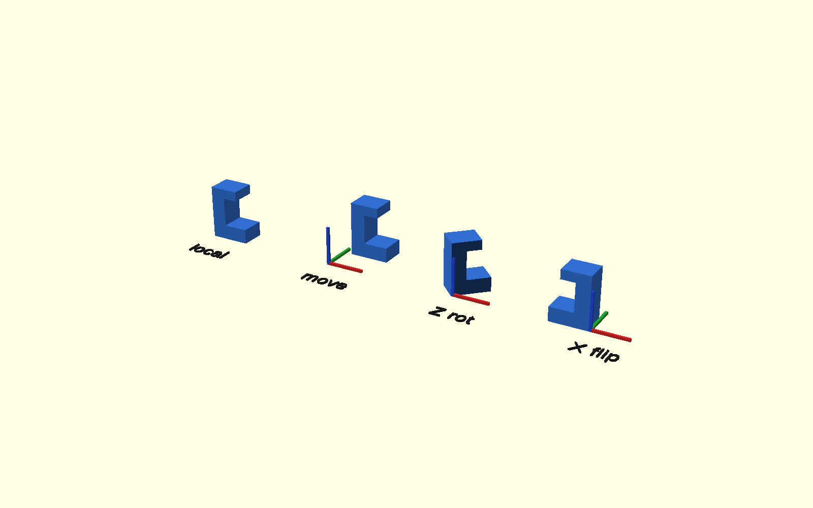
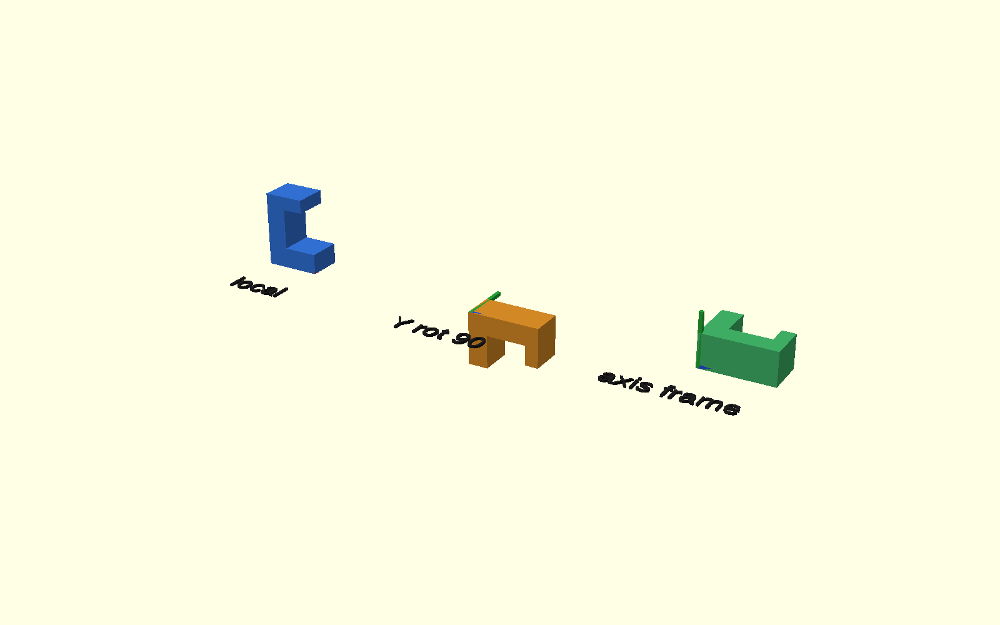
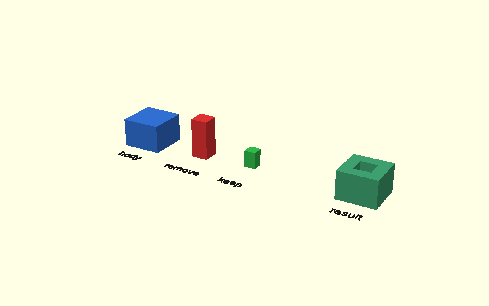
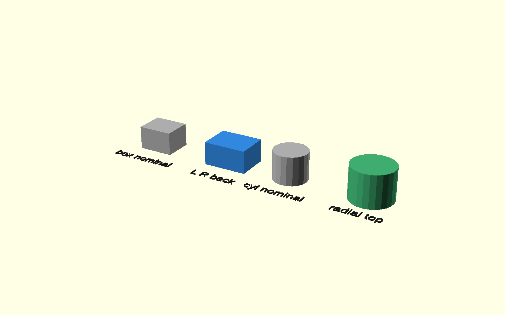
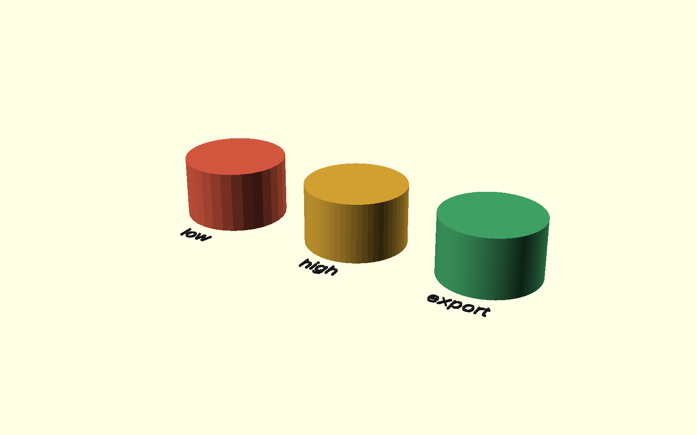

# Forge verification

This snapshot contains human-facing Forge verification evidence.

The source verification strategy is maintained in `doc/50-00-verification.md`.
A copy is included here as [50-00-verification.md](50-00-verification.md) so the
evidence snapshot remains self-contained.

Machine smoke tests also run for every public entrypoint and transform/cutter
variant. Their temporary STL/SVG files are intentionally not published.

## Visual evidence

### Transform helpers

Representative ordinary move, rotation and reflection behavior.

### Coordinate-frame semantics

Comparison of local geometry, a simple Y-axis rotation, and an explicit
coordinate-frame remap.

### Tagged CSG

Body/remove/keep construction roles beside the final tagged-difference result.

### Cutter overlap semantics

The visual uses exaggerated overlap so selected local directions are visible.
The exact default 0.001 mm overlap remains machine-asserted.

### Resolution levels

Low, high and export tessellation policy shown on the same nominal cylinder.

## Machine checks

The verification run also checks:

- exact low/high/export `$fn`, `$fa` and `$fs` policy;
- resolution scope, restoration, nesting and compatibility-alias behavior;
- ordinary 3D transform helpers plus object/frame forms;
- 2D XY/XZ/YZ move helpers through SVG export;
- tagged CSG through a real geometry render;
- direct/object cutter forms and independent overlap-token membership;
- the umbrella `forge.scad` entrypoint combining all API families.

See [50-00-verification.md](50-00-verification.md) for the intent/design/evidence mapping.

<!-- scad-project-evidence-navigation -->
## Producer execution evidence

These files describe the SCAD producer executions that actually created the retained output.
They remain unchanged when equivalent output is later hydrated from cache.

- [scad-verify execution](evidence/executions/scad-verify/execution.json) — capability, producer source revision, exact owner revision, result and producer timing when available.
  - [scad-verify log](evidence/executions/scad-verify/execution.log) — concise human-readable producer summary.

## Domain evidence

Structured SCAD/SCons reports contain the detailed target-level build and cache decisions.
They are richer domain evidence, not alternate producer logs.

- No structured domain reports are present for this output.

## Orchestration/materialization evidence

Current-run orchestration evidence explains why capabilities were selected, whether Moon executed or hydrated them, and how long current materialization and snapshot preparation took.
Producer execution evidence above remains the authority for the work that originally created cached output.

- Current orchestration evidence is attached by the publication layer.
- A later cache hydration may therefore have a current materialization revision that differs from the retained producer `source_revision`.

## Publication context

`publication-info.txt` records generated-branch context plus source, tooling and runtime provenance.
Publication/finalization consumes prepared output and must not rewrite producer execution evidence.
